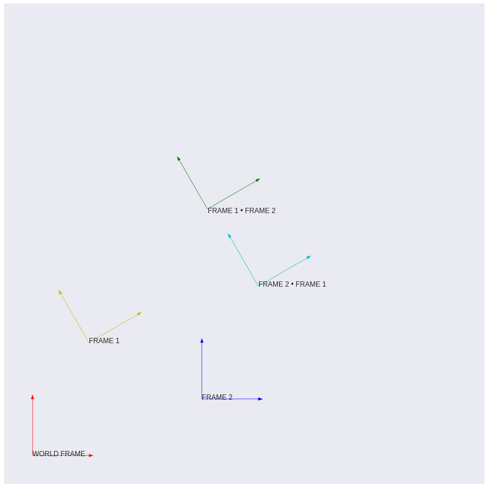

*Coordinate Frames Plotted with `robokit` and `matplotlib`*

[Robokit](https://pypi.org/project/robokit/) is being built as a giant feedback loop. To understand the maths of robotics more, I codify my understanding into the Robokit package, and as I begin apply more complex concepts, I use the Robokit package to do the math.

## Examples

Above is pictured the plot of some `robotkit.transform2d.pose2d()`, which represents my current understanding of coordinate frames and pose in two dimensions using [homogenous transformation matrices](../2018-11-18/2d-coordinate-frames-matplotlib). 

```python
# import all transform2d functions
from robokit.transform2d import *

# world_frame: no translation or rotation 
# a.k.a. transformation identity matrix

world_frame = pose2d(0, 0, 0)
#=> numpy.array([
# [1., 0., 0.],
# [0., 1., 0.],
# [0., 0., 1.]
# ])
        
# pose1: 
#	1 unit of translation in x
#	2 units of translation in y
#	30 degrees of positive rotation

pose1 = pose2d(1, 2, 30)
#=> numpy.array([
# [ 0.8660254, -0.5      ,  1.       ],
# [ 0.5      ,  0.8660254,  2.       ],
# [ 0.       ,  0.       ,  1.       ]
# ])

# pose2:
#	3 units of translation in x
#	1 unit of translation in y
#	0 degrees of rotation

pose2 = pose2d(3, 1, 0)
#=> numpy.array([
# [1., 0., 3.],
# [0., 1., 1.],
# [0., 0., 1.]
# ])
```

## Limitations

So far, the `robokit.transform2d` package does little more than return homogenous transformation matrices that combine a translation and rotation, together called pose. For example, in order to plot the coordinate frames, I had to independently write a function to interact with `matplotlib`

```python
import matplotlib.pyplot as plt

def coordinate_frame_plot2d(plt, transformation, color='b', debug=False):
  origin = transformation.dot(np.array([0, 0, 1]))[:2]
  xhat   = transformation.dot(np.array([1, 0, 1]))[:2]
  yhat   = transformation.dot(np.array([0, 1, 1]))[:2]
  
  plt.arrow(*origin, *(xhat - origin), head_width=0.05, color=color)
  plt.arrow(*origin, *(yhat - origin), head_width=0.05, color=color)
    
  if debug:
    print("transformation_matix: ", "\n", transformation, "\n")
    print("origin: ", "\n", origin, "\n")
    print("xhat: ", "\n", xhat, "\n")
    print("yhat: ", "\n", yhat, "\n")
```

This function first applies the transformation on the two homogenous vectors that describe a coordinate frame, `xhat`, and `yhat`, as well as the `origin`. 

Then, the function uses `matplotlib.pyplot.arrow()` to generate an arrow figure to plot. We use dependency injection to pass in `plt` as an argument, so that we can ensure all of our frames are plotting on the same figure, and to eliminate the use of state in order to create a pure function.

There are then some print statements that will be printed to `stdout` if the `debug` flag is set to true.

This functionality is not included in Robokit as I haven't be able to find a comfortable way to interface with `matplotlib` inside of the package. 

For now, on it's surface Robokit is just a big calculator, however, in the bigger picture, it's a tool that I'm using to strengthen my understanding of robotics maths concepts.

## Usage and Abusage

You can find the code for [Robokit on Github](https://github.com/Thomascountz/robokit).

Further documentation will be generated using the docstrings and docstring tests found in the code. 

Going forward, I'll continue to expand Robokit to include the knowledge I gain over time.

If you're interested in Robokit, I would highly recommend the completely feature full and well documentated pacakge: [`robopy`](https://pypi.org/project/robopy/), which is based on the Matlab package, [Robotics Toolbox](http://petercorke.com/wordpress/toolboxes/robotics-toolbox), built by Peter Corke.

### Full Example

The complete code to produce the plot above is as follows:

```python
# pip install robokit
from robokit.transform2d import *
import numpy as np
import matplotlib.pyplot as plt

def coordinate_frame_plot2d(plt, transformation, color='b', debug=False):
  origin = transformation.dot(np.array([0, 0, 1]))[:2]
  xhat   = transformation.dot(np.array([1, 0, 1]))[:2]
  yhat   = transformation.dot(np.array([0, 1, 1]))[:2]
  
  plt.arrow(*origin, *(xhat - origin), head_width=0.05, color=color)
  plt.arrow(*origin, *(yhat - origin), head_width=0.05, color=color)
    
  if debug:
    print("transformation_matix: ", "\n", transformation, "\n")
    print("origin: ", "\n", origin, "\n")
    print("xhat: ", "\n", xhat, "\n")
    print("yhat: ", "\n", yhat, "\n")
    
# Matplotlib Boilerplate
plt.grid('off')			    # Remove gridlines
plt.xticks([])			    # Remove x-axis tickmarks
plt.yticks([])			    # Remove y-axis tickmarks
plt.gca().set_aspect('equal')       # Set aspect ratio
plt.xlim(-0.5, 8)                   # Set x-axis range 
plt.ylim(-0.5, 8)                   # Set y-axis range
# Matplotlib Boilerplate

pose0 = pose2d(0, 0, 0)
coordinate_frame_plot2d(plt, pose0, color='r')

pose1 = pose2d(1, 2, 30)
coordinate_frame_plot2d(plt, pose1, color='y')

pose2 = pose2d(3, 1, 0)
coordinate_frame_plot2d(plt, pose2, color='b')

pose3 = pose1.dot(pose2)
coordinate_frame_plot2d(plt, pose3, color='g')

pose4 = pose2.dot(pose1)
coordinate_frame_plot2d(plt, pose4, color='c')

# plt.rcParams["figure.figsize"] = (15,15)                 # Figure size

plt.text(0, 0, "WORLD FRAME", fontsize=10)
plt.text(1, 2, "FRAME 1", fontsize=10)
plt.text(3, 1, "FRAME 2", fontsize=10)
plt.text(4, 3, "FRAME 2 • FRAME 1", fontsize=10)
plt.text(3.10, 4.3, "FRAME 1 • FRAME 2", fontsize=10)

plt.show()
```

